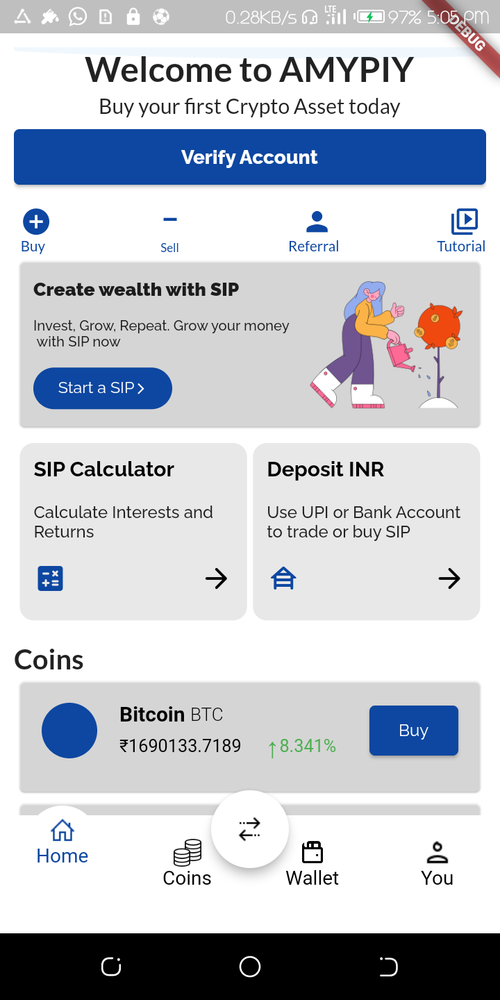
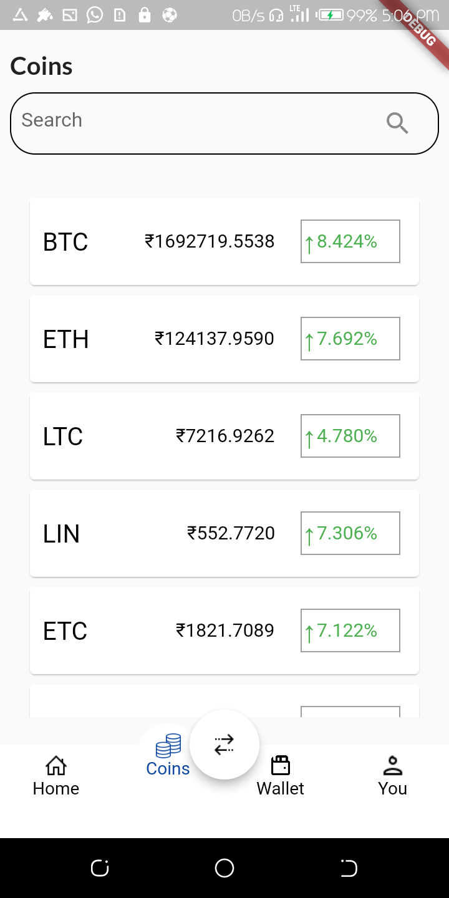

# bh_assignment

A new Flutter project.

## Getting Started

This project is an FLUTTER INTERNSHIP INTERVIEW TASK given by AI-BHARATA.

## The app test us on designing pixel perfect UI and being able to communicate to server to API using Websocket Api. 

## Screens
- Homescreen
- Coinscreen

## Screenshots  

  
    

